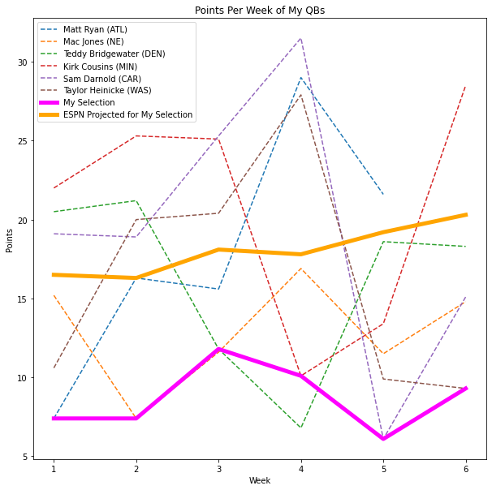
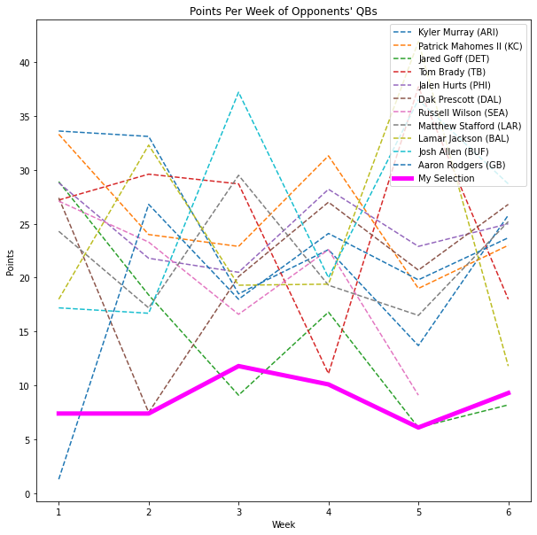
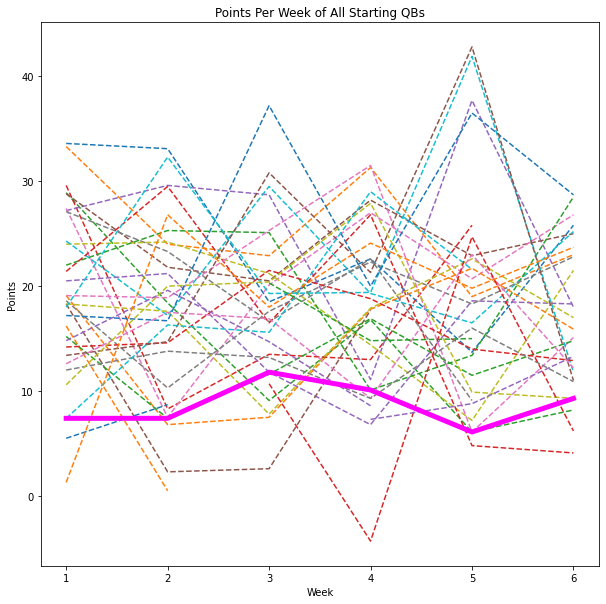
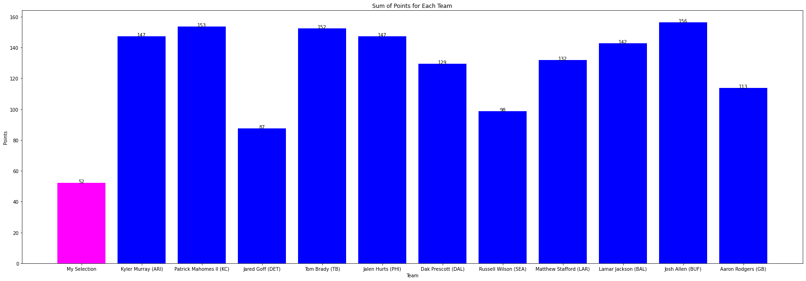
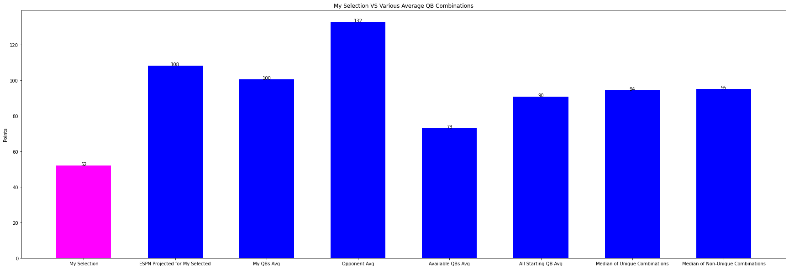
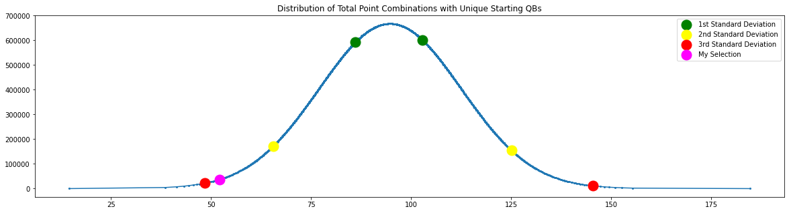
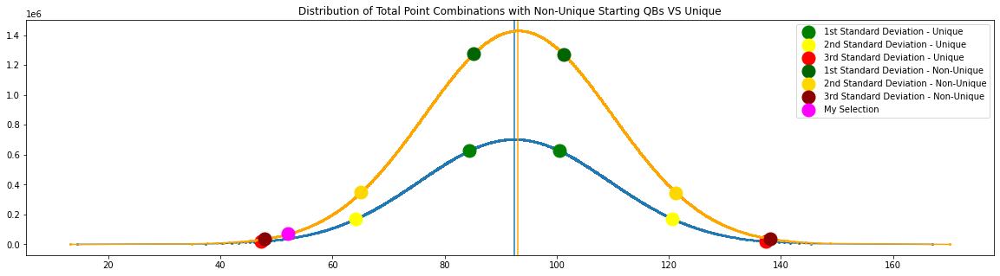
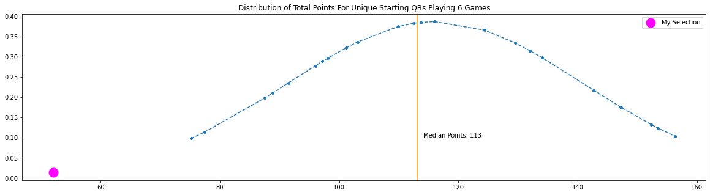

# WorstPossibleQBCombo
Just how bad were my first 6 weeks of fantasy qb selection? Let's find out!
## Introduction
This year (2021) was my first year participating in a NFL fantasy league. I have only vaguely paid attention to the NFL in the past so going into this year I had a lot of figuring out to do. I prioritized basically everything except a QB during the draft and grabbed a handful of mid-tier QBs... I ended up rotating through a good number of QBs through the early part of the season.... each week electing to pick someone new in hopes that they would bring greater fortune. By week 3 rumors of a curse had begun. By week 5 it seemed all but assured. People were reaching out to me to start their NFL teams' opponents in hopes it would bring their team victory. After another upsetting week 6, I decided I needed to know how bad my choices were. Surely something magical has happened. How could someone, actually trying quite hard to pick correctly, pick so bad so consistently? By this week I had played 6 different QBs. 5 weeks had been each QBs worst week so far and the last week was only that QBs second worst week...
I decided I needed some numbers to illustrate just how bad I had been so far. So I wrote some code!
## My Team
Before diving into the code, here is the team I ran for the first 6 weeks and the points they accrued. My league scoring is PPR, 0.04pt per passing yd, 6pt td and a -2 penalty for INT.

1) Matt Ryan - 7.36pts             ESPN Projected - 16.5

2) Mac Jones - 7.44pts  ESPN Projected - 16.3

3) Teddy Bridgewater - 11.8pts  ESPN Projected - 18.1

4) Kirk Cousins - 10.12pts  ESPN Projected - 17.8

5) Sam Darnold - 6.08pts  ESPN Projected - 19.2

6) Taylor Heinicke - 9.28pts  ESPN Projected - 20.3

Total accrued QB pts through week 6 - 52.16 An average of 8.69 per week

## The Code
My first version of this code used a couple of shortcuts to try to get an easier answer such as only considering QBs with over 5 points each week to cut out people I wouldn’t consider using. Obviously there are some errors with this as it is definitely possible for good QBs to have bad weeks and there are some QBs who don’t start in a game but end up scoring pretty well. I have gone through and rewritten my code to only consider starting QBs for each week.

I have also added the ability to toggle whether I am considering Unique or Non-Unique combinations of QBs. My selection utilizes a different QB each week, so initially I only was looking for the ranking within combinations of unique QBs but I wanted to know the overall ranking of this choice on all available choices.

I downloaded data for the total points per QB from a website week by week. The code first imports these files and creates a dict to store the data by player name (playerStats) through the helper function getPlayerStats.

There are two primary functions for the code, findCombos and findWorst.  findWorst calls findCombos which constructs a dict object with all possible combinations of QBs and their point totals by recursively calling itself for each week for each QB. The variable unique determines whether or not to consider using the same QB for multiple weeks or not. The list totals are then sorted using .sort() to organize them by ascending point totals. The collectInfo function is a helper function I used to collect data points to construct a distribution curve later in my analysis, along with the standard deviations, medians, max and mins. findWorst then iterates over the sorted list looking for our target chain of QBs and will report the index within the sorted list.

I use target, wk and unique to determine what the code is looking for. Excused is used to eliminate certain people from consideration such as people my opponents are running.

## Analysis
The biggest issue with this code is the run-time. When considering 6 weeks Non-Unique, we are looking at nearly 60,000,000 combinations. This takes large amounts of data and a large amount of time to compute. The runtime sits at O(QBs^wks).  Considering combinations of scores beyond wk 6 would take far more time than anyone would really care to wait. Next step for refining this code is finding a faster, more efficient algorithm. 

## Results
For only considering Unique combinations, my selection ranked: 178,938 of 29,684,354 permutations

This puts it in the bottom 0.6% for all Unique combinations.

For Non-Unique combinations: 319,938 of  59,976,000 permutations

Respectively the bottom 0.5%.

Remarkable.

Now! Let’s look at some graphs.

The following graphs were all built with matplotlib. The code is contained in the jupyter notebook file included in this repo.
The solid magenta line are my selections against some various data. First is the QBs I ran full 6 weeks. There was only 1 QB who had a worse week than the week I played him, Teddy Bridgewater. The orange line in this is the ESPN projected points for the QB I ran each week. I used this number as the biggest factor in considering who to run. This number does seem to run close to the middle of the average despite my ever growing distrust of the number.

The following two graphs show my scores against the other QBs in my league and the total roster of starting QBs. Everyone else in my league stuck with one QB all 6 weeks with one exception. The person who started Russell Wilson switched to Derek Carr after the injury in week 5. 

The next bar graph shows my total points against the total points of each opponents QBs. All these QBs played all 6 weeks except Wilson, who only had 5 games.

This shows my score against various averages. I have included the median of both the Unique and Non-Unique data sets. Interestingly, the Non-Unique data set has a slightly higher median and as we will see shortly, higher standard deviations.

This is the distribution curve for the Unique data set. I took plot points at every 10,000 entries and normalized them through the scipy.stats.norm function. The 
additional colored dots represent the first, second and third standard deviations. My data sits against that lower third deviation.

Next I compare the previous curve with the curve of the Non-Unique combinations in orange. As mentioned earlier the median sits slightly higher than the previous. The standard deviations all sit slightly higher as well.

The last graph I have is my selection total against the distribution curve of QBs who played all 6 weeks. 

Lastly, I wanted to include the worst and best scoring combinations.

For Unique combinations:
-  14.5, 'Andy Dalton (CHI)', 'Tua Tagovailoa (MIA)', 'Zach Wilson (NYJ)', 'Davis Mills (HOU)', 'Sam Darnold (CAR)', 'Daniel Jones (NYG)' 
-  184.7, 'Jameis Winston (NO)', 'Daniel Jones (NYG)', 'Sam Darnold (CAR)', 'Matt Ryan (ATL)', 'Justin Herbert (LAC)', 'Kirk Cousins (MIN)'

For Non-Unique combinations:
-  13.2, 'Andy Dalton (CHI)', 'Tua Tagovailoa (MIA)', 'Zach Wilson (NYJ)', 'Davis Mills (HOU)', 'Daniel Jones (NYG)', 'Daniel Jones (NYG)'
-  192.7, 'Jameis Winston (NO)', 'Daniel Jones (NYG)', 'Justin Herbert (LAC)', 'Sam Darnold (CAR)', 'Justin Herbert (LAC)', 'Kirk Cousins (MIN)'

## Final Thoughts
I picked bad. For someone actually trying to score points, I managed to do incredibly poor at it.

I used ESPN projected points as the biggest guidepost with who to pick each week. Some minor deviations based on matchups and input from r/fantasyfootball... I'm willing to wager that if I calculated the highest discrepancies between projected and actual points for the QBs available to me for the first 6 weeks, I would have the highest total making my selection technically the worst possible choice (working on this). Also as stated earlier, the weeks I had run Ryan, Jones, Cousins, Darnold, and Heineke had been their worst result within those 6 weeks, and Bridgewater only had 1 week that was worse than the one I had played him. The chances of me doing this alone are 0.0051%

My total points through the first 6 weeks was 52.16, averaging 8.69 per week. No QB that started the first 6 weeks put up fewer points than that. In fact the lowest point average of any of the QBs I had started was Mac Jones who averaged 13.91 over the first 6 weeks. Only one other QB started all 6 games for a lower average, Ben Rothlisberger at 13.20. If I had started any QB consecutively I would have done about 60% better than my jumping through QBs…

Looking at our averages in the graphs above we can see that Non-Unique combinations have a higher standard deviations than the Unique combinations. This illustrates how it is statistically better to stick with fewer QBs. If we consider the distribution of all QB totals, the data suggests that sticking with one QB is likely the best route.

The season did not improve much after this. Our regular season concluded at wk14. After that week I had an average of 11pts per week for my QB role which is worse than the average of any QB who played 10 or more games. I did finally settle on Joe Burrow, who had a magnificent week 15 - 17. Unfortunately for me, I did not make it to our post-season. It was very close, only 3 points separated me from the 6th seed…

My ultimate takeaway for next season: Stick with one QB!
